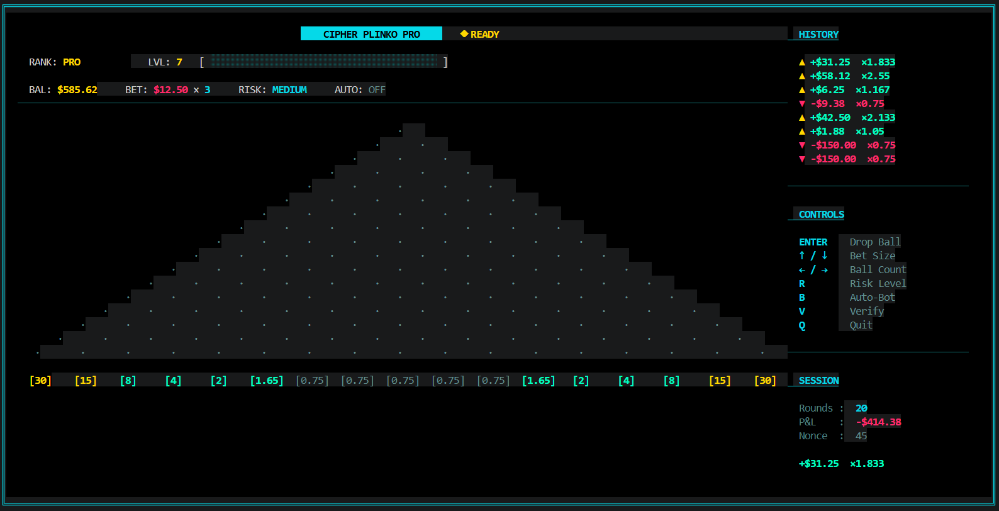

<div align="center">

# ◆ CIPHER PLINKO PRO

**A provably-fair terminal Plinko casino game — built in Go.**


</div>



---

## Features

- **Provably Fair** — every drop is derived from `SHA-256(serverSeed:clientSeed:nonce)`, independently verifiable
- **16-row pin board** — 17 multiplier slots, pure binomial p=0.5 physics, zero house manipulation
- **Three risk modes** — LOW / MEDIUM / HIGH, all tuned to ~102% RTP using binomial distribution math
- **XP & Rank progression** — ROOKIE → PRO → WHALE → CIPHER ELITE
- **Multi-ball drops** — drop up to 10 balls simultaneously with staggered animation
- **Auto-Bot mode** — continuous automated play
- **Audit Log** — verify any of the last 5 rounds with hash and nonce from the in-game Verify screen
- **Sovereign Elite aesthetic** — pure `#000000` black base, neon cyan / pink / gold palette, fixed-width geometric grid

---

## Installation

**Requirements:** Go 1.21+ · Terminal size 170×40 or larger

```bash
git clone https://github.com/yourname/cipher-plinko
cd cipher-plinko
go run .
```

Or build a binary:

```bash
go build -o cipher-plinko .
./cipher-plinko
```

---

## Controls

| Key      | Action                        |
|----------|-------------------------------|
| `ENTER`  | Drop ball(s)                  |
| `↑ / ↓` | Double / halve bet size       |
| `← / →` | Decrease / increase ball count (1–10) |
| `R`      | Cycle risk level (LOW → MEDIUM → HIGH) |
| `B`      | Toggle Auto-Bot               |
| `V`      | Open / close Verify screen    |
| `Q`      | Quit                          |

---

## Multiplier Table

All slots are symmetric. Slot 0 = leftmost edge, slot 16 = rightmost edge.

| Slot  | LOW    | MEDIUM  | HIGH    |
|-------|--------|---------|---------|
| 0 / 16 | 5.00× | 30×     | **800×** |
| 1 / 15 | 3.00× | 15×     | 100×    |
| 2 / 14 | 2.00× | 8×      | 26×     |
| 3 / 13 | 1.40× | 4×      | 9×      |
| 4 / 12 | 1.20× | 2.00×   | 3.50×   |
| 5 / 11 | 1.05× | 1.65×   | 2.00×   |
| 6–10  | 0.99× | 0.75×   | 0.30×   |

> RTP calculated via binomial distribution: `Σ P(slot_i) × mult_i` over all 17 slots on a 16-row board. All three modes are intentionally player-favorable at ~102%.

---

## Provably Fair

Every ball path is fully deterministic and externally verifiable:

```
hash  = SHA-256( serverSeed + ":" + clientSeed + ":" + nonce )
seed  = first 8 bytes of hash interpreted as int64
path  = 16 × Left/Right from rand.New(rand.NewSource(seed))
```

1. Server commits to a `serverSeed` before any play begins
2. Player supplies their own `clientSeed`
3. Each ball drop increments the `nonce` by 1
4. The resulting path is 100% reproducible given the same three inputs

Press **`V`** in-game to open the Verify screen — it shows seeds, nonce, and SHA-256 hash for the last 5 rounds. You can re-run the hash externally to confirm any outcome.

---

## Project Structure

```
cipher-plinko/
├── main.go          — entry point, seed configuration
├── engine/
│   └── engine.go    — provably fair SHA-256 path generator
├── ui/
│   ├── model.go     — game state, Model struct, key bindings
│   ├── logic.go     — ball physics, XP progression, round settlement
│   ├── view.go      — full TUI renderer (pyramid, bins, side panel)
│   └── styles.go    — Sovereign Elite color palette & Lipgloss styles
└── README.md
```

---

## Tech Stack

| Library | Role |
|---------|------|
| [Bubble Tea](https://github.com/charmbracelet/bubbletea) | Elm-architecture TUI event loop |
| [Lipgloss](https://github.com/charmbracelet/lipgloss) | Terminal styling and layout |
| `crypto/sha256` | Deterministic outcome generation |
| `encoding/binary` | Hash bytes → int64 seed |
| `math/rand` | Seeded PRNG for ball path |

---

## Roadmap

- [ ] SQLite persistence — balance, XP, and rank survive sessions
- [ ] Cipher Hub lobby — centralized entry for all Cipher games
- [ ] Cipher 21 — Blackjack sharing the same Universal Profile
- [ ] Audio (beep) and turbo mode
- [ ] SSH multiplayer + global leaderboards

---

## License

[MIT](./LICENSE)
